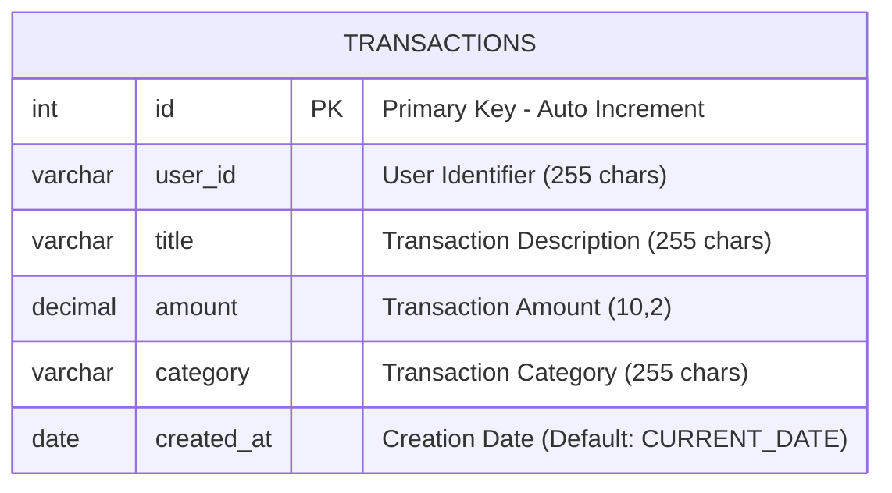
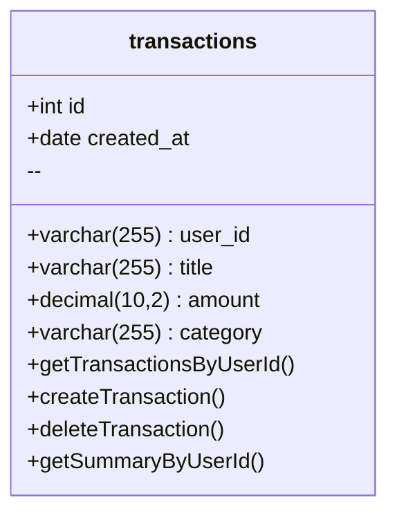
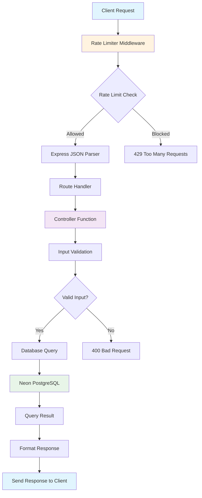
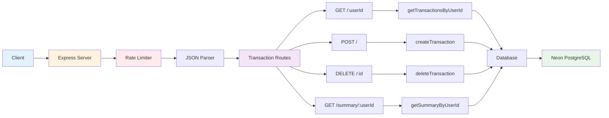
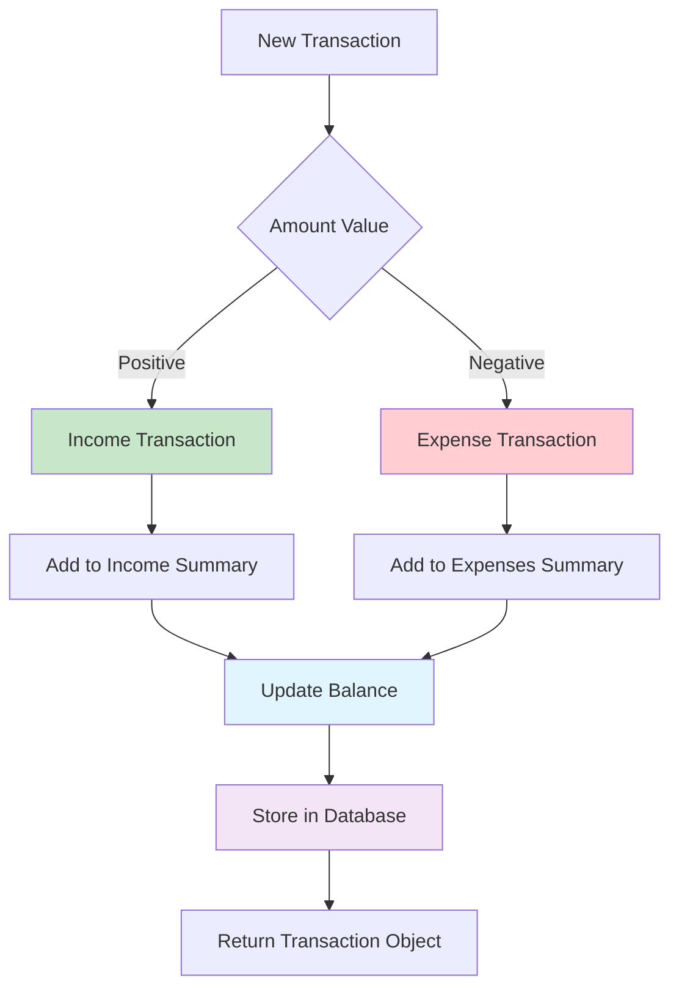
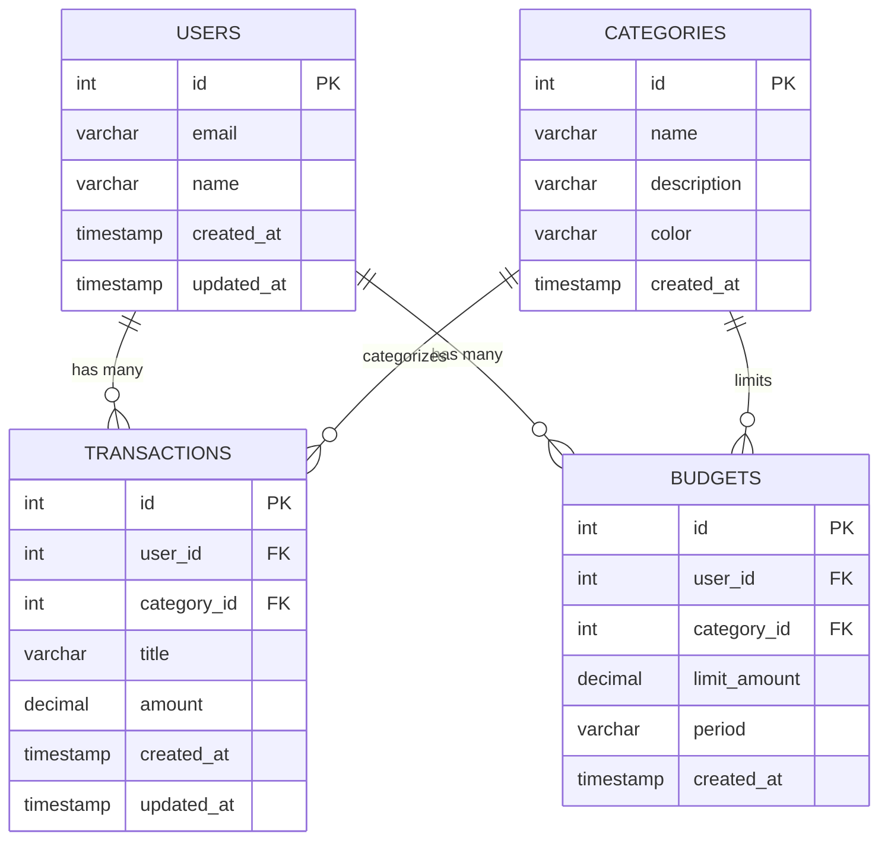

# Database Schema Diagrams / Diagramas de Esquema de Base de Datos

## Entity Relationship Diagram / Diagrama de Relación de Entidades

### English
This document contains the database schema diagrams for the Personal Finance Tracker backend application using Mermaid syntax.

### Español
Este documento contiene los diagramas de esquema de base de datos para la aplicación backend de seguimiento de finanzas personales usando sintaxis Mermaid.

## Main Database Schema / Esquema Principal de Base de Datos

## Detailed Table Structure / Estructura Detallada de Tablas

### Table: transactions

## Data Flow Diagram / Diagrama de Flujo de Datos

## API Endpoints Architecture / Arquitectura de Endpoints API

## Transaction Types Flow / Flujo de Tipos de Transacciones

## Database Constraints and Relationships / Restricciones y Relaciones de Base de Datos

### English

**Table: transactions**
- **Primary Key**: `id` (SERIAL, auto-increment)
- **Required Fields**: All fields are NOT NULL except `created_at` which has a default value
- **Data Types**:
  - `id`: SERIAL (auto-incrementing integer)
  - `user_id`: VARCHAR(255) - stores user identifier
  - `title`: VARCHAR(255) - transaction description
  - `amount`: DECIMAL(10,2) - monetary amount with 2 decimal places
  - `category`: VARCHAR(255) - transaction category
  - `created_at`: DATE - defaults to current date

**Business Rules**:
- Positive amounts represent income
- Negative amounts represent expenses
- Each transaction must belong to a user (user_id)
- Transactions are ordered by creation date (DESC) by default

### Español

**Tabla: transactions**
- **Clave Primaria**: `id` (SERIAL, auto-incremento)
- **Campos Requeridos**: Todos los campos son NOT NULL excepto `created_at` que tiene un valor por defecto
- **Tipos de Datos**:
  - `id`: SERIAL (entero auto-incrementable)
  - `user_id`: VARCHAR(255) - almacena identificador de usuario
  - `title`: VARCHAR(255) - descripción de la transacción
  - `amount`: DECIMAL(10,2) - cantidad monetaria con 2 decimales
  - `category`: VARCHAR(255) - categoría de la transacción
  - `created_at`: DATE - por defecto fecha actual

**Reglas de Negocio**:
- Cantidades positivas representan ingresos
- Cantidades negativas representan gastos
- Cada transacción debe pertenecer a un usuario (user_id)
- Las transacciones se ordenan por fecha de creación (DESC) por defecto

## Future Schema Extensions / Extensiones Futuras del Esquema

---

**Note / Nota**: These diagrams represent the current database schema and potential future extensions for the Personal Finance Tracker backend application.

**Nota**: Estos diagramas representan el esquema actual de la base de datos y posibles extensiones futuras para la aplicación backend de seguimiento de finanzas personales.